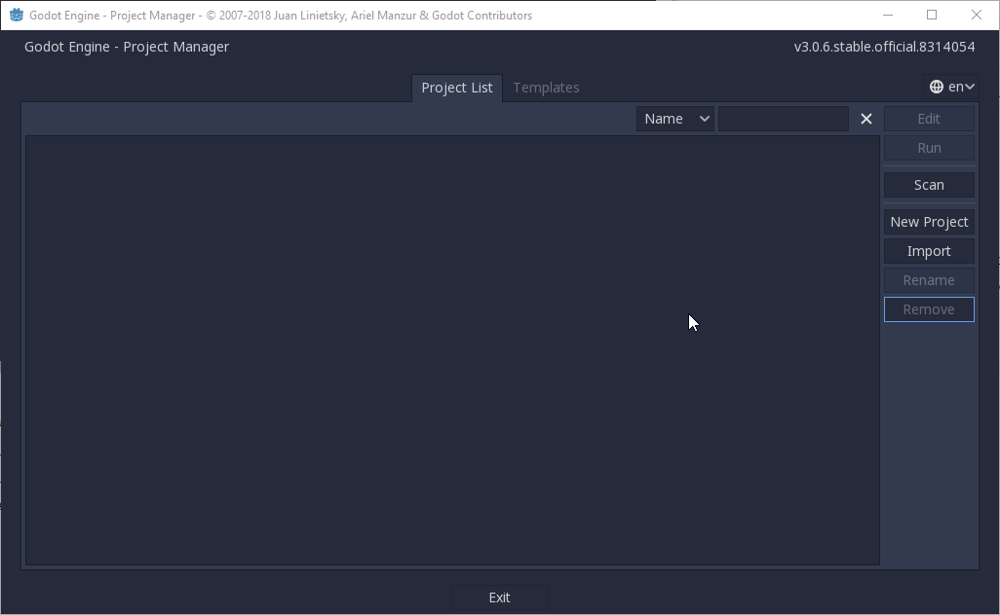
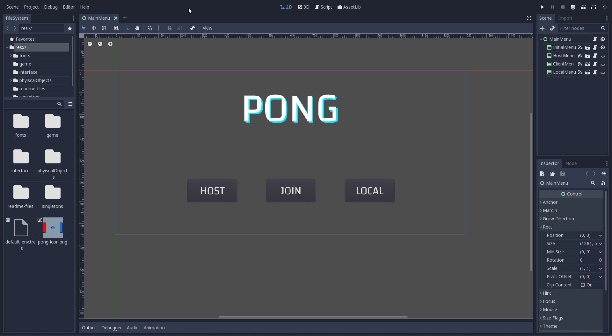

# Pong

The main goal of this pong project was to create a simple game with networking functionality.

# Getting Started

## Prerequisites

The only software needed is the [Godot Engine](https://godotengine.org/). The whole project was developed using version 3.0.6 but should be compatible with most 3.x versions.

A helpful extension for developing with [Visual Studio Code](https://code.visualstudio.com/) are the [Godot Tools](https://marketplace.visualstudio.com/items?itemName=geequlim.godot-tools).

Regarding version control Linux's bash is sufficient for using git. For Windows (Git For Windows)[https://gitforwindows.org/] can be used. Here I prefer to use the Git Bash for Windows as it has all the functionality needed to work with git.

## Opening the project

The project can be cloned using `git clone <url>` where URL needs to be replaced with the URL to this repository.

In order to open the project you can open up Godot, select *Import*, navigate to the clonde repository and select the `project.godot` file. Once that's done you can open and edit the project from your project list any time.

## Debugging two instances of Pong

Since this project has multiplayer functionality it's useful to have two instances of the same project up and running. The easiest way to debug the game is to use the Godot Editor itself since it has quite useful debugging featues. Simply open up the Godot editor two times and load the project in each.

In order to get the debugging features of Godot working in each instance of the game you need to adjust the debugging port for at least one editor. Navigate to **Editor** > **Editor Settings** and select the **Debug** category found in **Network**. There you can adjust the **Remote Port** to your liking. The key to success here is to have different remote ports for each running Godot Editor.

## Running the project locally

You can either export the project creating a project template for your operating system or run the project using the Godot Editor. In order to run the project via command line `godot interface/MainMenu.tscn` should do the trick.

For the local multiplayer only one instance of Pong needs to be running. In order to get the multiplayer functionality running you need to launch two instances of the game. While one instance needs to select **Host** in order to be the game's server the other instance needs to select **Join** which creates a client for the game. While it usually works to press the join button before the host it is recommended to **start the server before the client**.

For ease of use a blank IP-Address input when creating the client makes it connect to localhost `127.0.0.1` which is your local machine's loopback. In order to connect remotely you need to fill out the IP-Address input with the server's public IP-Address. Eventually the server might need to forward the port specified in `Network.gd` (currently 12345).